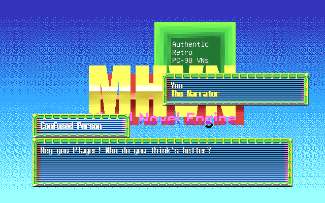

# MHVN Visual Novel Engine

## A PC-98 Compatible Visual Novel Engine

**The MHVN Visual Novel Engine** is a data-driven visual novel engine for the PC-9800 series. I want to make it a robust enough foundation for authentically retro VNs. In the future, the executable may be ported to modern platforms, and that would be all I have to do to port any VN made with this engine (though it does mean no graphic upgrade).

This engine is still in active development, with many missing features (such as lacking much of a 'visual' aspect at the moment). But they will come, and my plans are detailed in pc98_vnengine.txt, although I haven't planned out everything to full detail just yet. A very first release of the authoring tools may come soon.

## What's in this repository?

This repository contains project files for:

- MHVN98, the main PC-98 compatible executable.

- MHVNTEST, a simple test of the executable with some dummy data.

- MHVNLINK, links all data files together

- MHVNSCAS, scene script assembler

- MHVNTXAR, text archiver

This repository will contain project files for MHVN-specific tools in the future. Basic documentation on usage is in each directory.

## What's NOT in this repository?

- Tools I made that obviously have applicability beyond this project ([GPI](https://github.com/maxotaku11niku/GeneralPlanarImage)).

- PMD (as I did not develop it, go check Masahiro Kajihara's page).

- Any project files for full VNs I may make for this.
